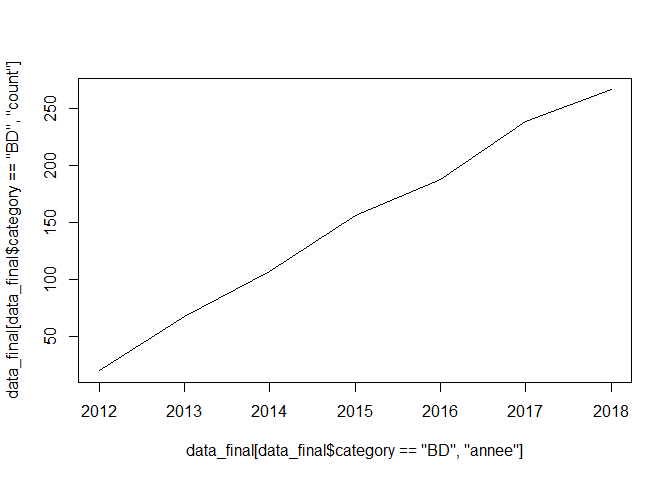
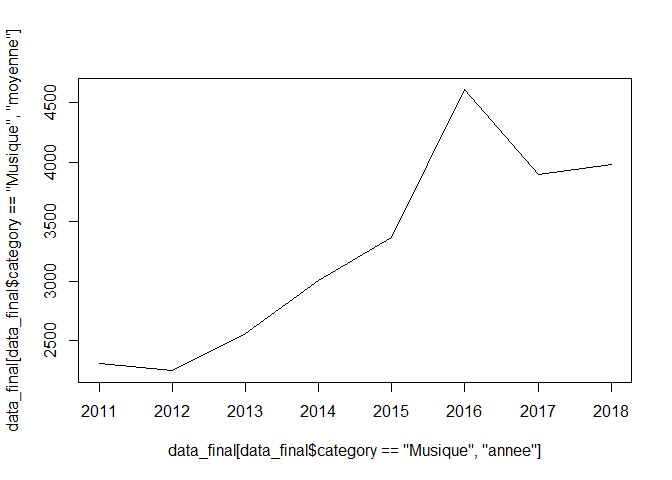

readme
================
Tapha
24/04/2020

``` r
setwd("~/projet expertise/GNING/GNING_TOP")
library(readr)
```

    ## Warning: package 'readr' was built under R version 3.6.3

``` r
library(dplyr)
```

    ## Warning: package 'dplyr' was built under R version 3.6.2

    ## 
    ## Attaching package: 'dplyr'

    ## The following objects are masked from 'package:stats':
    ## 
    ##     filter, lag

    ## The following objects are masked from 'package:base':
    ## 
    ##     intersect, setdiff, setequal, union

``` r
library(ggplot2)
```

    ## Warning: package 'ggplot2' was built under R version 3.6.3

``` r
library(lubridate)
```

    ## 
    ## Attaching package: 'lubridate'

    ## The following object is masked from 'package:base':
    ## 
    ##     date

``` r
data<-read_csv2("data_ulule_2019.csv")
```

    ## Using ',' as decimal and '.' as grouping mark. Use read_delim() for more control.

    ## Warning: Missing column names filled in: 'X1' [1]

    ## Parsed with column specification:
    ## cols(
    ##   .default = col_character(),
    ##   X1 = col_double(),
    ##   amount_raised = col_double(),
    ##   comments_count = col_double(),
    ##   finished = col_logical(),
    ##   goal = col_double(),
    ##   is_cancelled = col_logical(),
    ##   percent = col_double(),
    ##   date_end = col_datetime(format = ""),
    ##   date_start = col_datetime(format = ""),
    ##   id = col_double(),
    ##   goal_raised = col_logical(),
    ##   finished.1 = col_logical(),
    ##   news_count = col_double(),
    ##   nb_days = col_double()
    ## )

    ## See spec(...) for full column specifications.

``` r
data<-data[data$is_cancelled==FALSE,]
data <- data[data$country %in% c("FR","BE","IT","CA","ES","CH","DE","GB"),]


data_3<-data %>% 
  select(c(3,7,14))
data_4 <-data[,-c(3,7,14)]

taux_change <- 0.9

n<-nrow(data_3)

for (i in 1:n) {

  if(data_3$currency[i] != "EUR")
  {
    data_3$amount_raised[i] <- data_3$amount_raised[i] * taux_change
    data_3$goal[i] <- data_3$goal[i] * taux_change
    data_3$currency[i] <- "EUR"
  }
  
}

tmp <- cbind(data_4,data_3)

#changer le format des dates
tmp$date_end<-as.POSIXct(tmp$date_end)
tmp$date_start<-as.POSIXct(tmp$date_start)
tmp<- tmp %>%filter(tmp$date_end < ymd("2018-12-31"))
tmp["annee"] = year(tmp$date_start)
tmp['count'] = 1 

count = tmp %>% 
  filter(!is.na(tmp$category))%>% 
group_by(`annee`, `category`) %>% 
  summarise(count=  sum(count))

prop = tmp %>% 
  filter(!is.na(tmp$category))%>% 
group_by(`annee`, `category`) %>% 
  summarise(prop=  sum(`goal_raised`)/sum(count))

moyenne = tmp %>% 
  filter(tmp$goal_raised=="TRUE" & !is.na(tmp$category))%>% 
group_by(`annee`, `category`) %>% 
  summarise(moyenne=mean(`amount_raised`, na.rm = TRUE))

data_final<-merge(prop,moyenne, by=c("annee","category"), all=TRUE)
data_final <- merge(data_final,count,by=c("annee","category"), all=TRUE)
```

``` r
    plot(data_final[data_final$category=="BD", "annee"], data_final[data_final$category=="BD", "count"],type = "l")
```

<!-- -->

``` r
  plot(data_final[data_final$category=="Musique", "annee"], data_final[data_final$category=="Musique", "moyenne"],type = "l")
```

<!-- -->

``` r
  plot(data_final[data_final$category=="BD", "annee"], data_final[data_final$category=="BD", "prop"],type = "l")
```

<!-- -->

## R Markdown
